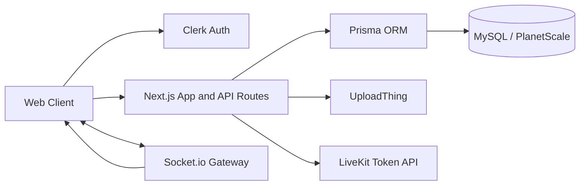

# Teamcord: Real-Time Chat Platform

Teamcord is a full-stack Discord-style chat platform built with Next.js, Socket.io, Prisma, MySQL, Clerk, UploadThing, LiveKit, Tailwind CSS, and TypeScript.

The project is structured as both a working product and a system-design case study for building real-time messaging at scale: WebSockets, pub/sub fanout, message persistence, distributed caching, presence, read receipts, media delivery, and voice/video rooms.

## System Design Focus

- Real-time channel and direct messaging over Socket.io
- REST APIs for paginated message history with infinite loading
- Socket event fanout for message create, edit, and delete events
- Polling fallback when the websocket connection is unavailable
- Authenticated membership checks before message writes
- Server/channel/member data model with role-based moderation
- Direct-message conversations and private chat history
- Attachment uploads through UploadThing
- Audio/video room access through LiveKit tokens
- Production scale-out plan for pub/sub, message queues, distributed cache, presence, and read receipts

Read the full system-design document here:

[docs/SYSTEM_DESIGN.md](docs/SYSTEM_DESIGN.md)

## Implemented Features

- Authentication with Clerk
- Server creation and customization
- Unique invite links and invite join flow
- Text, audio, and video channels
- One-to-one direct conversations
- One-to-one video calls
- Real-time message delivery with Socket.io
- Message edit and delete events broadcast in real time
- Attachment messages using UploadThing
- Infinite loading for message history with TanStack Query
- Member management with Admin, Moderator, and Guest roles
- Responsive desktop and mobile UI
- Light and dark mode
- Websocket status indicator with polling fallback
- Prisma ORM backed by MySQL

## Architecture Snapshot



For a multi-node production design, the Socket.io gateway fleet would use a shared pub/sub layer, message events would move through a durable queue, and Redis would hold low-latency state such as presence, typing indicators, socket sessions, rate limits, and read-receipt aggregation.

## Tech Stack

| Area | Technology |
| :--- | :--- |
| Frontend | Next.js 13, React 18, TypeScript |
| Styling | Tailwind CSS, Shadcn UI, Radix UI |
| Auth | Clerk |
| Realtime | Socket.io |
| Data fetching | TanStack Query |
| Database | MySQL with Prisma |
| File upload | UploadThing |
| Audio/video | LiveKit |
| Forms/validation | React Hook Form, Zod |

## Local Setup

### Prerequisites

- Node.js 18.x
- MySQL-compatible database
- Clerk application
- UploadThing application
- LiveKit project

### Install Dependencies

```shell
npm install
```

### Environment Variables

Create a `.env` file:

```env
NEXT_PUBLIC_CLERK_PUBLISHABLE_KEY=
CLERK_SECRET_KEY=
NEXT_PUBLIC_CLERK_SIGN_IN_URL=
NEXT_PUBLIC_CLERK_SIGN_UP_URL=
NEXT_PUBLIC_CLERK_AFTER_SIGN_IN_URL=
NEXT_PUBLIC_CLERK_AFTER_SIGN_UP_URL=

NEXT_PUBLIC_SITE_URL=
DATABASE_URL=

UPLOADTHING_SECRET=
UPLOADTHING_APP_ID=

LIVEKIT_API_KEY=
LIVEKIT_API_SECRET=
NEXT_PUBLIC_LIVEKIT_URL=
```

### Database Setup

```shell
npx prisma generate
npx prisma db push
```

### Run the App

```shell
npm run dev
```

## Available Commands

| Command | Description |
| :--- | :--- |
| `npm run dev` | Starts a development server |
| `npm run lint` | Runs Next.js linting |
| `npm run build` | Builds the production app |
| `npm run start` | Starts the production build |

## Project Positioning

This project can be presented as a real-time systems design project because it demonstrates the core product path in code while documenting how the same design evolves for high scale:

- WebSocket connection lifecycle and fallback behavior
- Message write path and event fanout
- Channel and direct-message data modeling
- Authorization checks at write boundaries
- Horizontal websocket scaling with pub/sub
- Queue-backed asynchronous processing
- Redis-backed presence and read-receipt state
- Operational concerns such as ordering, idempotency, observability, and failure recovery
