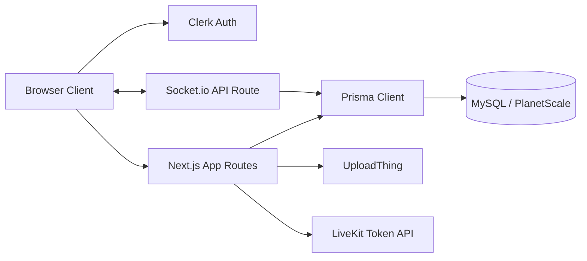
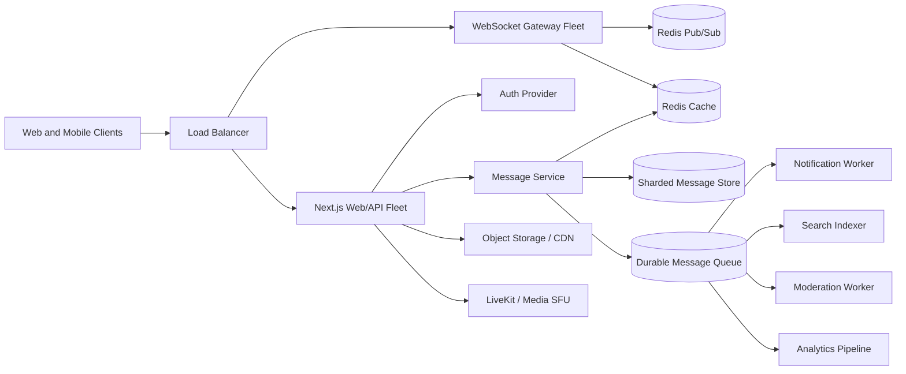
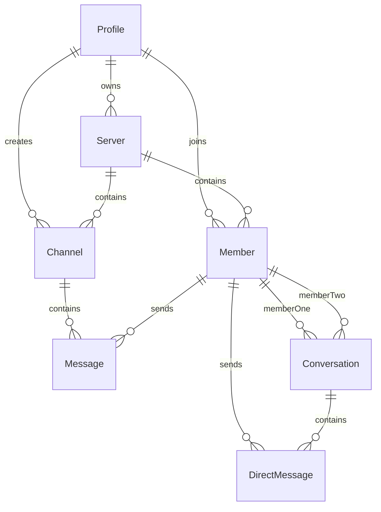
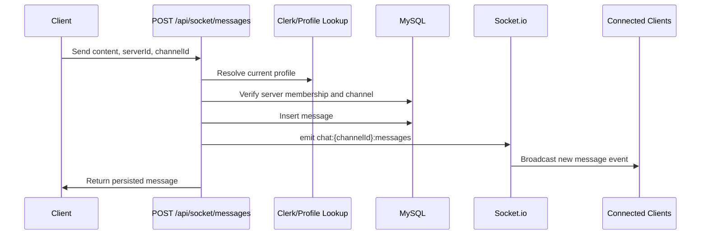
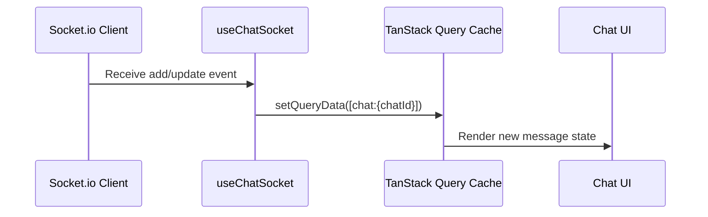
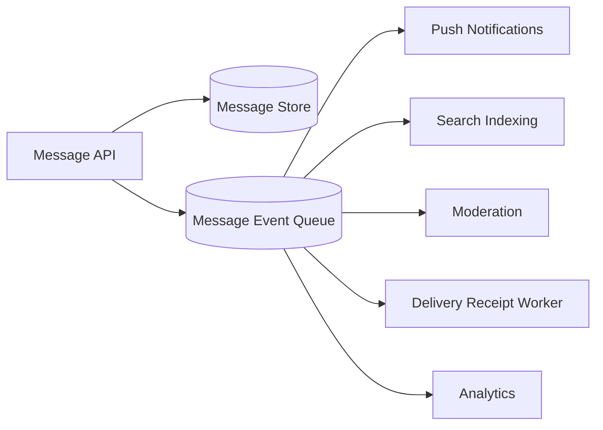
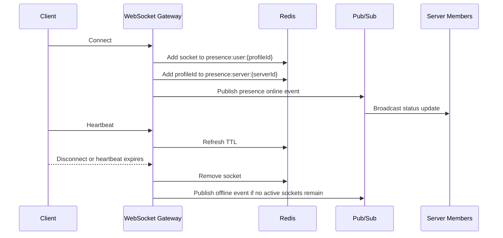
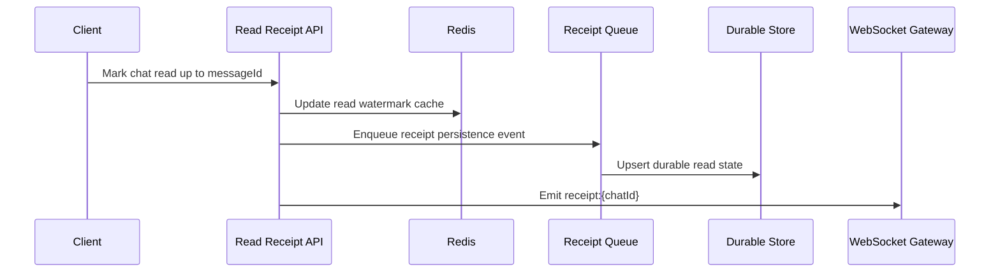

# Real-Time Chat Platform System Design

Teamcord is a Discord-style real-time chat platform. The current repo implements the core product path with Next.js, Socket.io, Prisma, MySQL, Clerk, UploadThing, and LiveKit. This document explains the current architecture and the production scale-out design for supporting millions of messages with low-latency delivery.

## 1. Goals

### Functional Requirements

- Users can sign up, sign in, and maintain a profile.
- Users can create servers, join servers through invite links, and manage members.
- Servers contain text, audio, and video channels.
- Members can send, edit, and delete text messages in channels.
- Members can send file attachments as messages.
- Members can create one-to-one direct-message conversations.
- Clients receive new, edited, and deleted messages in real time.
- Clients can load older messages through cursor-based pagination.
- Audio/video room access is issued through LiveKit tokens.
- The production design supports presence, read receipts, typing indicators, and notification fanout.

### Non-Functional Requirements

- Low-latency message delivery for online users.
- Horizontal scalability for websocket connections.
- Durable message storage.
- Ordered delivery within a single channel or conversation.
- Graceful degradation when realtime transport is unavailable.
- Authorization checks before every message write.
- Operational visibility into latency, failures, queue lag, and websocket health.

## 2. Current Implementation Map

| Concern | Current Implementation |
| :--- | :--- |
| Web app | Next.js 13 App Router |
| API routes | Next.js App Router and Pages API routes |
| Auth | Clerk |
| Profiles and membership | Prisma models: `Profile`, `Server`, `Member`, `Channel` |
| Channel messages | `Message` model |
| Direct messages | `Conversation` and `DirectMessage` models |
| Realtime transport | Socket.io |
| Message history | Cursor pagination with TanStack Query |
| Realtime cache update | `useChatSocket` updates TanStack Query pages |
| Fallback behavior | `useChatQuery` polls every second when socket is disconnected |
| Attachments | UploadThing |
| Audio/video | LiveKit token route |

Key files:

- `pages/api/socket/io.ts`: initializes the Socket.io server.
- `pages/api/socket/messages/index.ts`: creates channel messages and emits socket events.
- `pages/api/socket/messages/[messageId].ts`: edits/deletes channel messages and emits update events.
- `pages/api/socket/direct-messages/index.ts`: creates direct messages and emits socket events.
- `pages/api/socket/direct-messages/[directMessageId].ts`: edits/deletes direct messages and emits update events.
- `app/api/messages/route.ts`: fetches paginated channel history.
- `app/api/direct-messages/route.ts`: fetches paginated direct-message history.
- `hooks/use-chat-query.ts`: loads message history and handles polling fallback.
- `hooks/use-chat-socket.ts`: listens for realtime events and updates cached message pages.
- `components/providers/socket-provider.tsx`: owns the Socket.io client connection.

## 3. High-Level Architecture

### Current Repo Architecture



### Production Scale Architecture



The current application can run as a single full-stack app. At scale, websocket handling should be separated from stateless web/API traffic so websocket nodes can be scaled, monitored, and deployed independently.

## 4. Core Data Model



Important modeling decisions:

- `Member` connects a `Profile` to a `Server` and stores the user's server role.
- `Message` belongs to a `Channel` and a `Member`.
- `Conversation` represents a direct-message thread between two members.
- `DirectMessage` belongs to a `Conversation` and a `Member`.
- Messages use soft delete through the `deleted` flag so clients can show deletion history without losing ordering.
- Current indexes support lookup by `channelId`, `memberId`, and `conversationId`.

For a larger production workload, message IDs should be time-sortable, such as Snowflake IDs or UUIDv7 IDs, and message tables should be partitioned or sharded by `channelId`, `conversationId`, or `serverId`.

## 5. Realtime Message Flow

### Channel Message Create



### Client Cache Update



Current socket event names:

- New channel message: `chat:{channelId}:messages`
- Channel message update/delete: `chat:{channelId}:messages:update`
- New direct message: `chat:{conversationId}:messages`
- Direct message update/delete: `chat:{conversationId}:messages:update`

## 6. WebSockets

The repo uses Socket.io to provide realtime updates. The browser connects to:

```text
/api/socket/io
```

The server emits chat-specific events after database writes succeed. This makes the database the source of truth and prevents clients from receiving messages that were not persisted.

Current behavior:

- The client opens a Socket.io connection from `SocketProvider`.
- The UI displays a realtime status badge.
- `useChatSocket` subscribes to add/update event keys.
- `useChatQuery` falls back to one-second polling when disconnected.

Production improvements:

- Run websocket gateways as a separate service from the Next.js web app.
- Use sticky sessions or connection-aware routing at the load balancer.
- Use the Socket.io Redis adapter or another pub/sub layer so events emitted on one gateway reach sockets connected to other gateways.
- Track connection count, join latency, emit latency, disconnect reason, and reconnect rate.

## 7. Pub/Sub Design

### Current State

The current app emits directly through the in-process Socket.io server:

```text
API route -> Socket.io server -> connected clients
```

This is correct for a single-node deployment.

### Scale-Out State

In a multi-node deployment:

```text
Message write -> Redis/Kafka topic -> websocket gateways -> subscribed clients
```

Recommended topic design:

| Event | Partition Key | Reason |
| :--- | :--- | :--- |
| Channel message created | `channelId` | Preserves order within a channel |
| Direct message created | `conversationId` | Preserves order within a DM thread |
| Message edited/deleted | `chatId` | Keeps updates ordered with message stream |
| Presence changed | `serverId` or `profileId` | Limits fanout scope |
| Read receipt updated | `chatId` | Aggregates receipt state per chat |

Redis Pub/Sub is a good fit for low-latency ephemeral fanout. Kafka, Redpanda, Pulsar, SQS, or a similar durable queue is better for replayable event processing.

## 8. Message Queue Design

Message queues should be used for asynchronous work that does not need to block the send-message response.



Queue consumers:

- Notification worker: sends push/email notifications to offline users.
- Search worker: indexes message content and metadata.
- Moderation worker: scans suspicious content or attachments.
- Analytics worker: records usage events.
- Receipt worker: updates delivery/read summaries without blocking the message write.

Delivery semantics:

- The message database remains the source of truth.
- Queue events can be processed at least once.
- Consumers should be idempotent by message ID and event type.
- Clients should handle duplicate socket events by replacing or ignoring already-seen message IDs.

## 9. Distributed Caching

Redis or another distributed cache should store short-lived, high-read state.

Recommended cache keys:

| Key | Value | TTL |
| :--- | :--- | :--- |
| `presence:user:{profileId}` | active socket IDs, devices, last heartbeat | 30-60 seconds |
| `presence:server:{serverId}` | online member IDs | 30-60 seconds |
| `typing:{chatId}` | members currently typing | 5-10 seconds |
| `session:socket:{socketId}` | profileId, serverIds, connectedAt | connection TTL |
| `rate:user:{profileId}` | send-message counters | short rolling window |
| `read:{chatId}:{memberId}` | last read message/time watermark | short cache plus durable store |
| `channel:last:{channelId}` | latest message summary | cache invalidated on write |

The cache should never be the only copy of durable data such as messages. It should be used to reduce read load and coordinate realtime state across websocket nodes.

## 10. Presence Tracking

Presence is an eventually consistent, realtime state problem. It should be based on connection lifecycle plus heartbeat expiry.

### Presence Flow



Design choices:

- Store presence per user and per socket/device.
- A user is online if at least one active socket exists.
- Use TTLs so users eventually go offline even if disconnect events are missed.
- Broadcast presence only to relevant scopes, such as servers and direct-message peers.
- Keep `lastSeenAt` in durable storage for profile hover cards and offline state.

## 11. Read Receipts

Read receipts should be modeled as per-member watermarks, not per-message rows for every recipient.

### Recommended Durable Model

```text
ChannelReadState
- id
- channelId
- memberId
- lastReadMessageId
- lastReadAt
- updatedAt

ConversationReadState
- id
- conversationId
- memberId
- lastReadDirectMessageId
- lastReadAt
- updatedAt
```

Why watermarks:

- A channel with 10,000 members and 1,000 messages would create 10 million per-message receipt rows.
- A watermark stores one row per member per chat.
- Unread counts can be computed from messages newer than the watermark.
- Receipt updates can be batched and debounced.

### Read Receipt Flow



Client behavior:

- Mark messages as read when the chat is visible and the bottom message is in view.
- Debounce read updates to avoid writing on every scroll event.
- Optimistically update local unread counts.
- Use server-validated watermarks to correct client state after reconnect.

## 12. Message Ordering and Idempotency

Ordering guarantee:

- Ordering is required inside a channel or direct conversation.
- Global ordering across all chats is not required.

Recommended approach:

- Partition queue topics by `chatId`.
- Generate sortable message IDs.
- Store `createdAt` and server-generated IDs at write time.
- Let clients order by server timestamp or sortable ID.
- Use client-generated temporary IDs for optimistic UI, then replace with server IDs.

Idempotency:

- Accept an optional `clientMessageId` on send.
- Store a uniqueness constraint on `(memberId, clientMessageId)`.
- If a retry sends the same client ID, return the existing message.
- Make socket events idempotent by message ID.

## 13. History Pagination

The current app uses cursor-based pagination with a batch size of 10:

```text
GET /api/messages?channelId=...&cursor=...
GET /api/direct-messages?conversationId=...&cursor=...
```

This is better than offset pagination for growing message histories because cursor queries avoid scanning skipped rows.

Production improvements:

- Increase page size based on UX and payload limits, for example 30-50 messages.
- Use indexes that match the query pattern: `(channelId, createdAt, id)` and `(conversationId, createdAt, id)`.
- Return messages before a cursor timestamp or sortable ID.
- Cache recent channel history for hot channels.

## 14. Capacity Planning Example

Assumptions for a high-scale target:

| Metric | Example |
| :--- | :--- |
| Daily active users | 10 million |
| Peak concurrent users | 1 million |
| Average messages per active user per day | 100 |
| Messages per day | 1 billion |
| Average write rate | About 11,600 messages/second |
| Peak write rate | 50,000-100,000 messages/second |
| Average message payload | 1 KB metadata/content before attachments |
| Raw message storage | About 1 TB/day before indexes and replication |

Scaling implications:

- A single relational database is not enough for the largest target.
- Shard or partition message storage by chat or server.
- Keep large attachments outside the message store in object storage/CDN.
- Use queues for non-critical side effects.
- Use Redis for ephemeral state, not durable chat history.
- Keep websocket gateways stateless except for active socket mappings.

## 15. Storage Strategy

### Current Storage

The repo uses Prisma with MySQL. This is practical for development, demos, and moderate traffic.

### Production Storage

Recommended options:

- Sharded MySQL or Vitess/PlanetScale for relational consistency and operational familiarity.
- DynamoDB, Cassandra, or ScyllaDB for very high write volume and partitioned message timelines.
- Object storage plus CDN for attachments.
- OpenSearch or Elasticsearch for full-text message search.

Suggested partition keys:

- Channel messages: `channelId`
- Direct messages: `conversationId`
- Server-level metadata: `serverId`
- User inbox or notification state: `profileId`

## 16. API Surface

Current APIs:

| Method | Route | Purpose |
| :--- | :--- | :--- |
| `GET` | `/api/messages` | Fetch paginated channel messages |
| `POST` | `/api/socket/messages` | Create channel message and emit event |
| `PATCH` | `/api/socket/messages/[messageId]` | Edit channel message and emit update |
| `DELETE` | `/api/socket/messages/[messageId]` | Soft-delete channel message and emit update |
| `GET` | `/api/direct-messages` | Fetch paginated direct messages |
| `POST` | `/api/socket/direct-messages` | Create direct message and emit event |
| `PATCH` | `/api/socket/direct-messages/[directMessageId]` | Edit direct message and emit update |
| `DELETE` | `/api/socket/direct-messages/[directMessageId]` | Soft-delete direct message and emit update |
| `GET` | `/api/livekit` | Generate a LiveKit room token |

Future production APIs:

| Method | Route | Purpose |
| :--- | :--- | :--- |
| `POST` | `/api/read-states/channel` | Mark a channel read up to a message |
| `POST` | `/api/read-states/conversation` | Mark a DM read up to a message |
| `GET` | `/api/presence/server/:serverId` | Fetch online members for a server |
| `POST` | `/api/typing` | Publish typing state |
| `GET` | `/api/unread-counts` | Fetch unread counts for sidebar badges |

## 17. Security and Authorization

Current safeguards:

- Clerk-authenticated profile lookup.
- Server membership check before sending channel messages.
- Conversation participant check before sending direct messages.
- Role checks for message moderation.
- Message ownership check before edits.
- Soft delete for audit-friendly UI behavior.

Production additions:

- Rate limits per user, IP, server, and channel.
- Attachment scanning and content-type validation.
- Audit logs for moderation actions.
- Abuse detection for spam and mass mentions.
- Request payload size limits.
- Websocket authentication during connection setup.
- Per-event authorization for room joins and sensitive events.

## 18. Failure Handling

| Failure | Handling |
| :--- | :--- |
| Socket disconnect | Client switches to polling fallback |
| API write succeeds but socket emit fails | Message remains durable; clients recover through history fetch |
| Duplicate send retry | Use `clientMessageId` idempotency in production |
| Queue consumer failure | Retry with dead-letter queue |
| Redis presence failure | Treat presence as degraded; chat messages still work |
| Database write failure | Do not emit message event; return error |
| Websocket node failure | Clients reconnect through load balancer |

## 19. Observability

Important metrics:

- Message write latency.
- Socket event fanout latency.
- Websocket connection count.
- Reconnect rate.
- Polling fallback rate.
- Queue lag per consumer.
- Database query latency.
- Message write errors.
- Presence heartbeat expiry count.
- Read-receipt write rate.

Important logs/events:

- Auth failures.
- Membership check failures.
- Message create/update/delete events.
- Moderation actions.
- Socket connect/disconnect lifecycle.
- Queue retry and dead-letter events.

## 20. Interview Talking Points

- The current code demonstrates the real user path: authenticated message writes, persisted history, realtime fanout, and client cache updates.
- The database is the source of truth; socket events are a delivery mechanism.
- Cursor pagination keeps history loading efficient as channels grow.
- A single Socket.io node is enough for the demo, but production needs a pub/sub adapter or dedicated websocket gateway fleet.
- Redis is appropriate for ephemeral coordination such as presence, typing, rate limits, and socket session state.
- A durable queue decouples message writes from notifications, search indexing, moderation, analytics, and receipt aggregation.
- Read receipts should use member-level watermarks to avoid explosive per-message receipt rows.
- Message ordering should be guaranteed within a chat, not globally.
- Clients must be resilient to reconnects, duplicate events, and missed events by reconciling against paginated history.

## 21. Current vs Production Scope

| Area | Current Repo | Production Scale Design |
| :--- | :--- | :--- |
| Realtime messages | Implemented with Socket.io | Websocket gateway fleet with pub/sub adapter |
| Message persistence | Implemented with Prisma/MySQL | Sharded or partitioned message store |
| Pagination | Implemented with cursors | Larger pages, compound indexes, hot history cache |
| Polling fallback | Implemented | Keep as recovery path with backoff |
| Attachments | Implemented with UploadThing | Object storage, CDN, scanning |
| Voice/video | Implemented with LiveKit token flow | Dedicated LiveKit/SFU infrastructure |
| Presence | Designed | Redis TTL, heartbeats, scoped broadcasts |
| Read receipts | Designed | Per-member watermarks with batched persistence |
| Queues | Designed | Durable queue for async side effects |
| Distributed cache | Designed | Redis for presence, typing, rate limits, sessions |

